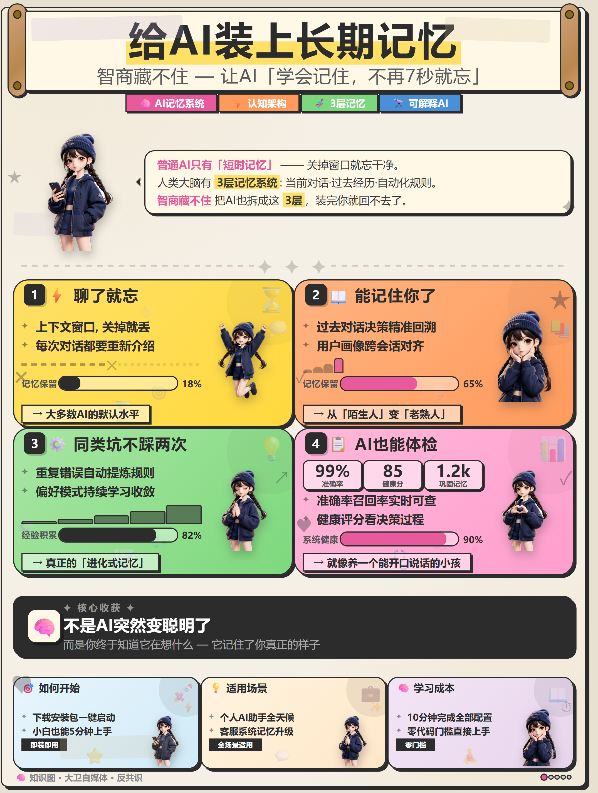

# km-poster-generator
> [English](README.md) · [中文](README_zh.md)

阿甜米色手帐风 · 知识图海报生成器。数据驱动，只改一份 JSON 即可复现同款 3:4 小红书种草长图——固定布局、固定人物 IP、固定装饰。



## 效果

输出约 1080×1440（3:4）PNG，固定包含：

- 顶部大标题 + 英文风副标题 + 标签气泡
- 卡通女孩 IP 角色 × 5（同一角色不同姿势，3D 皮克斯风格）
- 2×2 色块分类卡片（进度条 + 高亮词）
- 底部黑色「核心收获」总结区
- 底部三张行动卡
- 手帐风装饰：胶带、贴纸、分割线、阴影

## 快速开始

```bash
# 克隆
git clone https://github.com/qianqiuwanzi/km-poster-generator.git
cd km-poster-generator

# 安装依赖
pip install playwright
playwright install chromium

# 修改内容
# 编辑 content.json（字段说明见下方）

# 生成海报
python generate.py

# 产物在 output/poster.png
```

## content.json 字段说明

| 字段 | 说明 | 示例 |
|------|------|------|
| `title` | 顶部大标题 | `"给AI装上长期记忆"` |
| `subtitle` | 副标题（支持 emoji） | `"智商藏不住 — 让AI不再7秒就忘"` |
| `tags` | 4 个标签（emoji + 词） | `["🧠 AI记忆系统", "⚡ 认知架构"]` |
| `intro` | 引言气泡（支持 `<strong>` `<em>` `<br>`） | `"<strong>普通AI</strong> 只有短时记忆..."` |
| `b1`~`b4` | 四个色块卡片 | 见下方子字段 |
| `sum` | 底部核心收获黑区 | `{label, main, sub}` |
| `a1`~`a3` | 底部三张行动卡 | `{title, item1, item2, highlight}` |
| `footer` | 页脚文字 | `"🧠 知识图 · 大卫自媒体"` |

### 色块卡片子字段（b1~b4）

| 子字段 | 说明 |
|--------|------|
| `title` | 卡片标题（emoji + 中文） |
| `item1` / `item2` | 两行说明文字 |
| `barlabel` | 进度条标签 |
| `bar` | 进度值 0~100 |
| `barcolor` | 进度条颜色（`#2C2C2C` 深色 / `#E85A9C` 粉色交替） |
| `highlight` | 高亮金句 |
| `b4` 独有 | `m1/m1l` `m2/m2l` `m3/m3l`（三项指标：数值 + 标签） |

**注意**：只改 JSON 的**值**，不要改键名和结构。

## 渲染说明

`generate.py` 内嵌自适应渲染流水线：

1. Playwright 打开填充后的 HTML
2. 按比例压缩子元素 margin/padding/gap，使内容高 ≈ 1400px（保持字号不变）
3. 在 2×2 色块 / 核心收获 / 底部三卡之间显式留 20px 缝隙
4. 视口高度跟随海报真实右下角位置（防止底部被裁）
5. 精确 `bounding_box` clip（含阴影余量），零裁切

## 目录结构

```
km-poster-generator/
├── SKILL.md              # 技能流程定义 + 字段参考
├── README.md             # 本文件
├── content.json          # 示例文案（智商藏不住）
├── content.schema.json   # JSON Schema 验证
├── generate.py           # 生成器（填文案 + 渲染）
├── template.html         # 占位符模板（54 个 {{...}}）
├── assets/
│   └── characters/       # 5 张透明抠图角色（_rb.png）
├── tests/                # 基础渲染 + Schema 测试
└── tools/                # 调试脚本
```

## 调试工具

```bash
# 诊断渲染高度问题
python tools/debug_height.py

# 诊断各区块是否正常
python tools/debug_sections.py
```

## License

MIT
